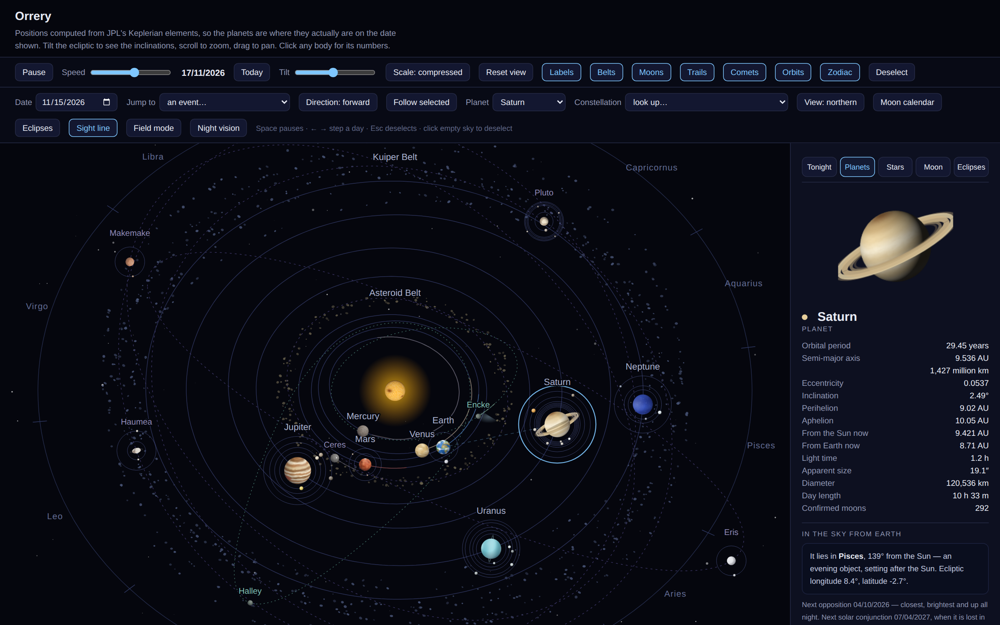

# Orrery

An interactive model of the solar system that runs entirely in a browser, in a single
self-contained HTML file with no build step, no dependencies and no network calls.

Planetary positions are computed from JPL's Keplerian elements, so the planets are where they
actually are on the date shown. Orbits carry their real eccentricities and inclinations, bodies
move by Kepler's second law, and the surfaces are rendered procedurally at load rather than
pasted in as textures.

**[Live demo](https://martyn-gg.github.io/orrery/)**



## What it does

**The model**

- Real positions for any date from JPL's *Keplerian Elements for Approximate Positions of the
  Major Planets*, valid roughly 1800–2050 and good to a few arcminutes
- True ellipses — real eccentricity, perihelion direction and inclination — with positions from
  solving Kepler's equation, so the sweep rate is genuinely non-uniform
- A tilt control that lifts the ecliptic into three dimensions: Pluto's 17° orbit visibly rides
  above Neptune's, the Kuiper Belt becomes a torus, Halley runs retrograde at 162°
- Three radial scales: compressed, square-root and true. Only *true* is geometrically exact;
  the others bend the radius to fit everything on one page
- Asteroid and Kuiper belts as inclined tori with real differential rotation
- 31 major moons orbiting their planets at true relative rates
- Comets Halley and Encke, with tails that grow as the inverse square of distance
- Zoom, pan, follow-a-body, reverse time, jump to a date or to a historical event

**Observing**

- Where each body is in tonight's sky: constellation, elongation from the Sun, morning or evening
  object, apparent size in arcseconds
- Retrograde charts — the apparent path against the stars over the loop nearest your date, with
  stationary points and dates
- Star charts for 32 constellations with named asterisms (the Plough, the Sickle, the Teapot,
  the Southern Cross…), the ecliptic drawn through, and live planet positions plotted on them
- Northern / southern hemisphere switch: patterns rotate 180°, visibility and circumpolar status
  swap, moon phases flip
- Moon phase calendar with principal phases solved to the minute
- Eclipse table, 2026–2035, with paths of totality and local percentages
- Field mode for phones, with a red night-vision filter that preserves dark adaptation

## Running it

**Just open it.** `index.html` is completely self-contained — double-click it on Windows, macOS
or Linux and it works offline, forever. Nothing is fetched, nothing is tracked, no dependencies.

**Install it as an app.** When served over HTTP(S) it registers as a progressive web app, so
Chrome and Edge offer *Install*, Safari on macOS offers *Add to Dock*, and Android and iOS offer
*Add to Home Screen*. You get a proper standalone window with its own icon, and it keeps working
with no connection.

**Host it.**

```bash
git clone https://github.com/martyn-gg/orrery.git
cd orrery
python3 -m http.server 8000     # or: npx serve
```

Then open <http://localhost:8000>.

**Publish it on GitHub Pages.** The included workflow deploys on every push to `main`. Enable it
under *Settings → Pages → Source → GitHub Actions*.

**Embed it in a page.**

```html
<iframe src="https://martyn-gg.github.io/orrery/"
        style="width:100%;aspect-ratio:16/10;border:0;border-radius:12px"
        title="Orrery" loading="lazy"></iframe>
```

## What is computed and what is not

Being clear about this matters more than looking clever.

**Computed here:** planetary and dwarf-planet positions, distances, elongations, apparent sizes,
oppositions and conjunctions, retrograde loops and stationary points, moon phase and distance,
constellation membership, rising and setting geometry, and every surface texture.

**Not computed here:** the eclipse table. Predicting a path of totality needs Besselian elements
and a full lunar theory; the abridged theory driving the phase calendar is nowhere near precise
enough. Those entries are published figures, credited in [DATA-SOURCES.md](DATA-SOURCES.md),
rather than model output dressed up as prediction.

**Known limits**, all stated in the page footer too:

- Planetary perturbations are ignored, so wind the clock centuries away and the outer planets
  drift from reality
- Ceres, Haumea, Makemake, Eris and the comets use fixed osculating elements with a mean motion —
  good to a fraction of a degree in this era, not survey grade
- The lunar theory carries the main perturbation terms and lands the principal phases within
  about half an hour
- Star charts show principal pattern stars only, at J2000 positions
- Planet sizes are not to scale in any mode; use the size comparison in the panel
- Rising, setting and altitude assume 51.5°N or 33.9°S depending on the hemisphere switch

## Verification

The ephemeris was checked against published sky guides rather than assumed correct. For
12 August 2026 the model independently places Mars on the Taurus–Gemini border, Uranus beside the
Pleiades, Mercury and Jupiter low in Cancer, Saturn and Neptune in Pisces, all as pre-dawn
objects with Venus alone in the evening sky — matching the published guide on every planet.
Saturn's opposition comes out as 4 October 2026 and Mars's as 19 February 2027; Halley sits at
0.587 AU at its 1986 perihelion, its true perihelion distance; and new moon falls on
12 August 2026, the date of the total solar eclipse over Iceland and Spain.

## Browser support

Any current version of Chrome, Edge, Firefox or Safari, on desktop or mobile. It uses SVG, Canvas
2D and modern JavaScript, with no polyfills and no transpilation.

## Licence

Code and prose: [MIT](LICENSE). Astronomical data is factual and not subject to copyright, but the
sources deserve credit — see [DATA-SOURCES.md](DATA-SOURCES.md).

## Author

Martyn Greville-Giddings — [@martyn-gg](https://github.com/martyn-gg)
