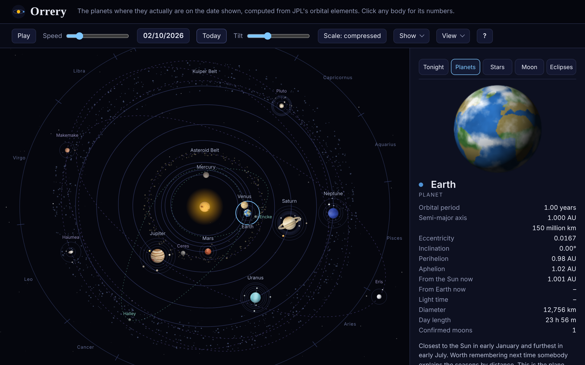

# Orrery

An interactive model of the solar system that runs entirely in a browser, in a single
self-contained HTML file with no build step, no dependencies and nothing fetched to work it out.

Planetary positions are computed from JPL's Keplerian elements, so the planets are where they
actually are on the date shown. Orbits carry their real eccentricities and inclinations, bodies
move by Kepler's second law, and the surfaces are rendered procedurally at load.

**[Live demo](https://greville-giddings.me/orrery/)**



## What it does

**The model**

- Real positions for any date from JPL's *Keplerian Elements for Approximate Positions of the
  Major Planets*, valid roughly 1800–2050 and good to a few arcminutes
- True ellipses, with real eccentricity, perihelion direction and inclination, and positions from
  solving Kepler's equation, so the sweep rate is non-uniform
- A tilt control that lifts the ecliptic into three dimensions: Pluto's 17° orbit visibly rides
  above Neptune's, the Kuiper Belt becomes a torus, Halley runs retrograde at 162°
- Three radial scales: compressed, square-root and true. Only *true* is geometrically exact;
  the others bend the radius to fit everything on one page
- Asteroid and Kuiper belts as inclined tori with real differential rotation
- 31 major moons at their true orbital periods, driven by the same clock as the planets
- Comets Halley and Encke, with tails that grow as the inverse square of distance
- Zoom, pan, follow-a-body, reverse time, jump to a date or to a historical event
- Shareable links: the address bar holds the date, the chosen body, tab or constellation, tilt,
  scale, hemisphere and direction of time, so a copied link opens the same view (zoom and pan
  are not included, and neither is your location)
- A notice whenever the date leaves 1800–2050, the span the orbital elements are good for

**Observing**

- Where each body is in tonight's sky: constellation, elongation from the Sun, morning or evening
  object, apparent size in arcseconds
- Rising, setting and best viewing times for the Moon and the five naked-eye planets, sunset,
  sunrise and the hours of darkness, for southern England, Sydney or a place you set (kept in your
  browser only)
- The sky now: an all-sky chart for your place and the time on the clock, with the
  constellation figures, the ecliptic, the Moon in its phase and turned towards the Sun, the
  planets and, by day, the Sun. Tap the Moon or a planet for its details
- Each part of the Tonight panel folds away, and the panel remembers which parts you closed
- With the clock stopped, Today (Now in field mode) keeps the orrery on the real time. Phones open
  this way, in field mode
- Coming up: the next oppositions, greatest elongations, Venus or Mercury passing between the
  Earth and the Sun (and the rare transits), close passes of the Moon by a planet or by a bright
  star in a dark sky where you are, close pairs of planets, the start and end of retrograde
  motion, meteor shower peaks with the Moon's light that night, the solstices and equinoxes, and
  the Earth's nearest and furthest points from the Sun. Each one is a tap away, and any of them
  can be saved to your calendar as an .ics file made in the browser
- The year ahead: when each naked-eye planet is in the evening or morning sky from your place
- A compass direction beside each planet's best time, so you know where to look
- Retrograde charts: the apparent path against the stars over the loop nearest your date, with
  stationary points and dates
- Star charts for 33 constellations with named asterisms (the Plough, the Sickle, the Teapot,
  the Southern Cross…), the ecliptic drawn through, and live planet positions plotted on them
- Northern / southern hemisphere switch: patterns rotate 180°, visibility and circumpolar status
  swap, moon phases flip
- Moon phase calendar with principal phases solved to the minute
- Eclipse table, 2026–2035, with paths of totality and local percentages
- Field mode for phones, with a red night-vision filter that preserves dark adaptation

## Running it

**Just open it.** `index.html` is completely self-contained. Double-click it on Windows, macOS
or Linux and it works offline. Opened from disk it makes no network requests at all; served
from a website, it fetches only its own app manifest, icons and offline cache script.

**Install it as an app.** When served over HTTP(S) it registers as a progressive web app, so
Chrome and Edge offer *Install*, Safari on macOS offers *Add to Dock*, and Android and iOS offer
*Add to Home Screen*. You get a proper standalone window with its own icon, and it keeps working
with no connection.

**Host it.**

```bash
git clone https://github.com/martyn-gg/orrery.git
cd orrery
python3 -m http.server 8000     # or: npx serve
```

Then open <http://localhost:8000>.

**Publish it on GitHub Pages.** The included workflow deploys on every push to `main`. Enable it
under *Settings → Pages → Source → GitHub Actions*.

**Embed it in a page.**

```html
<iframe src="https://greville-giddings.me/orrery/"
        style="width:100%;aspect-ratio:16/10;border:0;border-radius:12px"
        title="Orrery" loading="lazy"></iframe>
```

## What is computed and what is not

**Computed here:** planetary and dwarf-planet positions, distances, elongations, apparent sizes,
oppositions and conjunctions, retrograde loops and stationary points, moon phase and distance,
constellation membership, rising and setting geometry, and every surface texture.

**Not computed here:** the eclipse table. Predicting a path of totality needs Besselian elements
and a full lunar theory; the abridged theory driving the phase calendar is nowhere near precise
enough. Those entries are published figures, credited in [DATA-SOURCES.md](DATA-SOURCES.md).

**Known limits**, all stated in the notes at the foot of the page too:

- Planetary perturbations are ignored, so wind the clock centuries away and the outer planets
  drift from reality
- Ceres, Haumea, Makemake, Eris and the comets use fixed osculating elements with a mean motion,
  good to a fraction of a degree in this era
- The lunar theory carries the main perturbation terms and lands the principal phases within
  about half an hour
- Star charts show principal pattern stars only, at J2000 positions
- Planet sizes are not to scale in any mode; use the size comparison in the panel
- Rising and setting times agree with published times for London to within two minutes for the
  Sun and planets and four for the Moon

## Verification

The ephemeris was checked against published sky guides. For
12 August 2026 the model independently places Mars on the Taurus–Gemini border, Uranus beside the
Pleiades, Mercury and Jupiter low in Cancer, Saturn and Neptune in Pisces, all as pre-dawn
objects with Venus alone in the evening sky, matching the published guide on every planet.
Saturn's opposition comes out as 4 October 2026 and Mars's as 19 February 2027; Halley sits at
0.587 AU at its 1986 perihelion, its true perihelion distance; and new moon falls on
12 August 2026, the date of the total solar eclipse over Iceland and Spain.

Those checks, and others, are now a script. `tools/check.mjs` loads the page in headless
Chromium and tests it against published figures: opposition, conjunction and elongation dates,
fourteen principal phases of the Moon, the Coming up list's timings for October 2026 to July 2027 from In-The-Sky.org
(conjunctions, stationary points, meteor shower peaks, the seasons, the Earth's nearest and
furthest points, and the Moon passing the Pleiades and Regulus), Polaris standing at the
observer's latitude on the sky chart, the year-ahead chart on four dates,
the 2032 transit of Mercury, and rising and setting times for London on 2 October 2026 from
timeanddate.com.
It also checks that the planets travel anticlockwise, that a link restores the view, that the
date-range notice appears when it should, that the opening view fits a 21:9 window, that a
calendar file is well formed and downloads, that Coming up follows the observer's hemisphere,
that a polar night is described as one, that folded sections stay folded, that the sky chart
opens a planet when tapped, that a phone opens on the real time with the clock stopped, and that
the page loads without errors at desktop and phone sizes. To run it:

```bash
npm install --no-save --include=dev playwright   # once; node_modules is gitignored
node tools/check.mjs
```

It prints one line per check and exits non-zero if any fail.

## Browser support

Any current version of Chrome, Edge, Firefox or Safari, on desktop or mobile. It uses SVG, Canvas
2D and modern JavaScript, with no polyfills and no transpilation.

## Licence

Code and prose: [MIT](LICENSE). Astronomical data is factual and not subject to copyright, but the
sources deserve credit; see [DATA-SOURCES.md](DATA-SOURCES.md).

## Author

Martyn Greville-Giddings, [@martyn-gg](https://github.com/martyn-gg). More at <https://greville-giddings.me/>.
